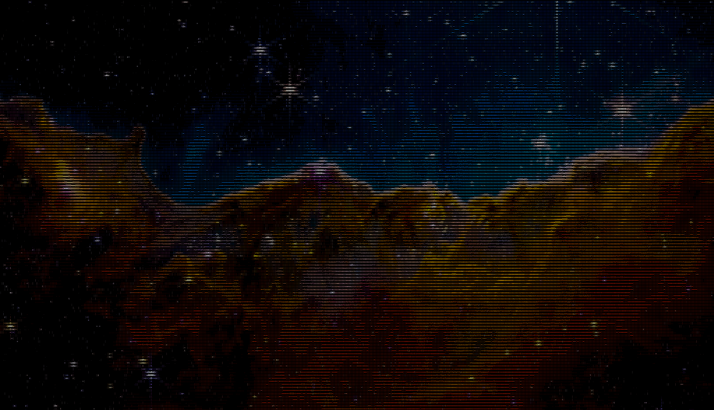

# Aski

**Pictures, reconsidered as type.**

Aski turns images into character art: portraits in blocks, landscapes in punctuation,
photographs with a second life as a grid of glyphs.

It's a **Swift library and macOS command-line tool**. Convert an image once, then render
plain text, colored attributed text, or a `CGImage`. Add masks, motion, and effects—or
trade the characters for pixel-art, brick, and mosaic tiles. Conversion runs locally.



<sub>512 columns × 133 rows of characters, rendered to PNG by Aski. Zoom in: the texture is type.
Source image: NASA/ESA/CSA/STScI. [Image and corpus](docs/Research/Corpus/nasa-occupancy-v1/).</sub>

**Swift 6.3+ · iOS 18+ · macOS 15+ · visionOS 2+ · [Apache 2.0](LICENSE)**

[Try the CLI](#try-it) · [Use in Swift](#use-in-swift) · [Documentation](docs/README.md) · [Contributing](CONTRIBUTING.md)

## Try it

On a Mac with full Xcode selected and a Swift 6.3+ toolchain, start with the image
already in the repository. No hunt for a sample file required.

```bash
git clone https://github.com/BigCactusLabs/Aski.git
cd Aski
mkdir -p /tmp/aski-demo

xcrun swift run -c release aski render \
  docs/Research/Corpus/nasa-occupancy-v1/assets/carina-cosmic-cliffs.jpg \
  --columns 120 \
  --output /tmp/aski-demo/carina.txt \
  --render-png /tmp/aski-demo/carina.png \
  --width 1600

open /tmp/aski-demo/carina.png
```

That writes a plain-text grid and a 1600-pixel-wide color PNG. It is a smaller demo,
not a byte-for-byte reproduction of the hero above. The first run resolves package
dependencies and builds the executable.

For your own image, from the checkout:

```bash
xcrun swift run aski photo.jpg --columns 80
xcrun swift run aski render photo.jpg --charset blocks --background clear --render-png blocks.png
xcrun swift run aski inspect photo.jpg --format json --output inspection.json
```

`render` is the default command. Plain text has **no color**; PNG and attributed-string
output preserve per-cell color. The CLI uses source-faithful aspect by default.

Masks, exact-width exports, manifests, reusable builds, and troubleshooting:
[Command-line guide](Sources/Aski/Aski.docc/CommandLine.md).

## Use in Swift

Add Aski through Xcode's package dependencies, or add it to `Package.swift`. Choose a
published tag from [Releases](https://github.com/BigCactusLabs/Aski/releases); the
`v0.7.0` dependency is:

```swift
dependencies: [
    .package(url: "https://github.com/BigCactusLabs/Aski.git", exact: "0.7.0"),
]
```

Then attach the library product to your app or executable target:

```swift
.target(
    name: "YourTarget",
    dependencies: [.product(name: "Aski", package: "Aski")]
)
```

These are excerpts from a package manifest, not a complete manifest. Before the
`v0.7.0` tag is published, use the source-checkout route above or add the checkout as a
local package in Xcode. Earlier private-history tags are not available in this repository.

Given a `CGImage`, the conversion-and-render path is small:

```swift
import Aski
import CoreGraphics

func renderCharacterArt(from image: CGImage) -> CGImage {
    let grid = DefaultConverter().convert(image, columns: 80)
    return grid.renderImage(
        font: .system(size: 12),
        backgroundColor: CGColor(red: 0, green: 0, blue: 0, alpha: 1),
        scale: 2,
        preserveSourceAspect: true
    )
}
```

The same grid also offers `renderPlainText()` and `renderAttributedString()`—no second
conversion needed. [Getting Started](Sources/Aski/Aski.docc/GettingStarted.md) covers
loading an image, choosing a palette, and rendering each output format.

## Give it a different character

Change the alphabet, change the mood. Ten built-in character sets range from printable
ASCII to Unicode blocks, line work, and braille. Custom sets can be rasterized from a font.

For a dithered block treatment:

```swift
let converter = ASCIIConverter(
    characterSet: StandardCharacterSet.blocks,
    palette: BuiltInPalette.ansi16,
    algorithm: .dotMatrix
)
```

For one deliberately fixed look, `VesperPreset.canonical.render(image)` pairs block
glyphs with bone and oxblood colors. [Vesper](Sources/Aski/Aski.docc/Vesper.md) documents
the recipe and its evidence; it is a preset, not a separate app included in this package.

| Make | With |
| --- | --- |
| Character art, from punctuation to braille | [Character sets](Sources/Aski/Aski.docc/CharacterSets.md), [algorithms](Sources/Aski/Aski.docc/Algorithms.md), and [palettes](Sources/Aski/Aski.docc/PaletteMatching.md) |
| PNGs, colored text, or plain-text grids | Independent [renderers](Sources/Aski/Aski.docc/Rendering.md), including exact-pixel-width image output |
| Photo-to-type dissolves and cutouts | Raster [masks](Sources/Aski/Aski.docc/Masking.md), soft edges, and fallback backgrounds |
| Glows, grain, lighting, and layered compositions | [Effects](Sources/Aski/Aski.docc/Effects.md), with capability-dependent Metal/Core Image paths |
| Reveals, pulses, and moving character grids | [Animation](Sources/Aski/Aski.docc/Animation.md) from one conversion; [MP4/GIF](Sources/Aski/Aski.docc/Video.md) conversion through the library |
| Pixel-art, brick, and mosaic treatments | [Tile grids](Sources/Aski/Aski.docc/Tiles.md): three modes, five cell shapes |

`aski render` is the still-image CLI, not a command-line wrapper around every library
feature. Video and other experiment harnesses live under `aski lab`. HDR/emissive
rendering is [research-only SPI](Sources/Aski/Aski.docc/HDRRendering.md), not ordinary
public API.

## A small engine, with receipts

Glyph selection and color processing are separate. The default matcher uses a
brightness shortlist plus a 60D log-polar descriptor; the default color path uses
linear-light sampling, OKLab palette matching, and Ray Trace gamut mapping. The
`Aski` library has no third-party runtime dependencies.

More dimensions are not a quality guarantee. At the shipping sampling footprint,
only 2–3 descriptor bins are reached; research has also found a tone-only baseline
beating the production matcher on the frozen sparse `blocks` preset. Aski does **not**
claim reliable orientation preservation or universal superiority over brightness ramps.

The interesting part is testing what actually works. [Design notes](DESIGN.md) explain
the engine; [the direction decision](docs/Research/2026-09-03-future-direction-and-architecture.md)
and [research index](docs/Research/README.md) carry methods, limitations, negative results,
and retractions. Failed experiments leave evidence, not permanent production switches.

## Status and compatibility

Aski is **pre-1.0**. Public does not mean frozen: minor releases may change source APIs
or rendered output. Exact pins make upgrades deliberate; [CHANGELOG.md](CHANGELOG.md)
and [release notes](docs/release-notes/) explain the changes.

The package targets Apple platforms and uses strict Swift 6 concurrency. It is not a
Linux or Windows CLI. The library's deployment minimums above are separate from the
[contributor snapshot baseline](CONTRIBUTING.md#toolchain-and-snapshot-baseline).

`v0.7.0` begins the public release history. Older issue numbers, commit SHAs, and tags
in retained research refer to private development and may not be accessible here.

## Build with us

Good bug reports, clearer examples, surprising renders, and careful experiments are
all welcome. Start with [CONTRIBUTING.md](CONTRIBUTING.md) for setup, verification,
research etiquette, and what belongs in a PR.

Work lands through short-lived branches and pull requests. The [Backlog](backlog/)
tracks tasks; [Blotter](AGENTS.md#blotter) records reusable engineering lessons. Both
are public. Tests and DocC validation run locally; there is no hosted CI workflow in
this repository.

## Go deeper

[Documentation hub](docs/README.md) · [CLI guide](Sources/Aski/Aski.docc/CommandLine.md) ·
[Architecture](docs/architecture.md) · [API catalog](Sources/Aski/Aski.docc/Aski.md) ·
[Agent guide](AGENTS.md) · [Machine-readable entry point](llms.txt)

## License and credits

Aski is licensed under [Apache 2.0](LICENSE). See [NOTICE](NOTICE) for attribution and
glyph-descriptor provenance. Bundled Courier Prime is copyright 2015 The Courier Prime
Project Authors and uses the [SIL Open Font License 1.1](Sources/Aski/Resources/Fonts/OFL.txt).
Research assets carry their own corpus manifests; the package license does not replace
those asset terms.
