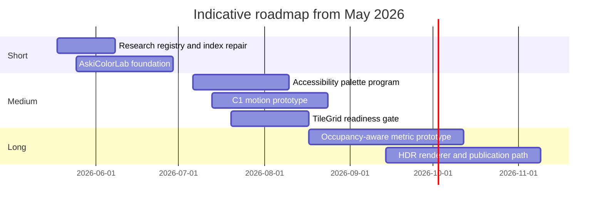
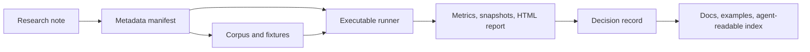

# Aski Research Synthesis and Strategic Roadmap

> **The release sequencing below is historical and no longer authoritative.** This document remains authoritative for strategic synthesis, white-space analysis, and research-line rationale.

This synthesis is based on the existing files in `docs/Research`. It cleans up and connects the current research notes; it does not re-run the external searches behind those notes.

## Executive Summary

The `docs/Research` folder already functions like a serious applied-research program, not a loose collection of notes. Its center of gravity is a technically differentiated rendering engine built on shape-context-style glyph matching and an ambitious OKLAB color pipeline, then extended outward into tile-grid rendering and algorithmic animation. The README formalizes a repeatable note pattern of "Question -> field survey -> what we picked," which is the right substrate for compounding research rather than re-deriving it each time.

The strongest conclusion from the folder is strategic: Aski should not chase browser feature parity for its own sake. Browser-first web playgrounds already own the video, GIF, webcam, export, and showcase territory. Aski remains differentiated in native-platform integration, shape-aware still-image conversion, and deeper color handling. The least crowded and most defensible white space is therefore a native, perceptually serious, local-first representation engine that can render, animate, tile, and eventually react to images on device.

The highest-leverage next move is not another isolated memo. It is to turn the existing hypotheses into executable labs. The color-science deep dive already contains falsifiable conjectures and seven runnable experiments; the TileGrid hardening note already contains a matrix harness and benchmark ritual. Those are fragments of a research operating system. The missing piece is a single metadata, corpus, and CI layer that binds them together.

The recommended posture is threefold:

- Keep the core library focused on rendering primitives.
- Operationalize color and accessibility experiments first.
- Build one shared benchmark substrate for ASCII, TileGrid, and animation evaluation.

The roadmap below assumes budget, team size, and final ship dates are unspecified; all effort figures are indicative.

## Inventory of the Research Folder

The source set for this synthesis contains six Markdown files: one README, four indexed dated research notes, and one additional hardening memo. Status labels below are inferred from each document's role because the repo does not explicitly mark lifecycle states. `TileGridInternalHardening.md` is now indexed in the README alongside the dated notes.

| File | Purpose | Method | Key findings | Status inferred |
|---|---|---|---|---|
| [`README.md`](README.md) | Defines what belongs in research and how notes should be structured | Folder governance note | Establishes the note template and indexes the main dated entries | Published internal guide |
| [`2026-05-05-oversample-shape-context-cells.md`](2026-05-05-oversample-shape-context-cells.md) | Investigates why `edgeEmphasis` produced no differing cells in practice | Bug-triggered paper/tool survey | `oversample = 2` effectively gates the Sobel path; expose an oversample knob without breaking current defaults | Experiment |
| [`2026-05-05-color-science-deep-dive.md`](2026-05-05-color-science-deep-dive.md) | Validates and challenges Aski's color pipeline against current practice | Three-pass literature review + protocol design | Confirms parts of the current pipeline, identifies HyAB/CAM16/HDR/CVD as frontier areas, and proposes seven executable experiments plus original conjectures | Experiment |
| [`2026-05-06-a2-tile-grid-design-decisions.md`](2026-05-06-a2-tile-grid-design-decisions.md) | Hardens design choices for a parallel colored-cell pipeline | 14 frontier-search questions | Separate geometry/shape axes, keep `TileGrid` render-many, adopt Wu + k-means, resist premature protocols/public commitments | Draft design memo |
| [`TileGridInternalHardening.md`](TileGridInternalHardening.md) | Stabilizes semantics before public API commitments | Internal invariants + harnesses + benchmark ritual | TileGrid is still internal; semantics, matrix generation, and benchmark discipline matter more than public packaging | Draft internal memo |
| [`2026-05-10-c1-animation-design-decisions.md`](2026-05-10-c1-animation-design-decisions.md) | Hardens a native algorithmic animation subsystem | 13 frontier surveys + repeated code review corrections | Lazy `AnimatedASCIIGrid`, top-K visually similar candidates, entrance/ongoing split, pure-data SoA schedule, sync API | Draft design memo |

Two patterns matter more than the inventory itself. First, the folder already spans three distinct layers of work: core engine science, subsystem design memos, and operational hardening. Second, only the color-science note already specifies experiments/corpora in a way that is directly executable; that is why it should seed the next phase of work rather than remaining an isolated reference document.

## Cross-Document Synthesis

Theoretical lineage is clear and unusually coherent. The rendering core is anchored in structure-aware ASCII rather than brightness-ramp novelty, which keeps it close to the original structure-based ASCII art literature and to shape-descriptor work rather than commodity "image to ASCII" filters. That same posture explains why the oversample memo treats per-cell sampling as a real algorithmic issue, not a cosmetic tuning knob, and why the folder concludes that Aski's real strength is not animation gimmicks but shape fidelity and color handling.

Architecturally, the notes repeatedly make the same family of choices: immutable and `Sendable` value types, lazy synthesis over materialized buffers, "convert once, render many," render-time styling, synchronous APIs unless a concrete consumer proves otherwise, and explicit resistance to premature abstractions such as shared converter protocols or public API promises. A2 does this for `TileGrid`; C1 does it for `AnimatedASCIIGrid`; the hardening memo says it bluntly by instructing that TileGrid is not public-ready yet. This is not incidental style. It is the dominant design doctrine of the repo.

Methodologically, the repository already does something many research folders never achieve: it preserves judgment. The README establishes a reusable note schema; A2 and C1 both record the field evidence, the chosen path, and what was explicitly rejected; the color-science memo goes further and names falsification thresholds. This means the folder is already halfway between design docs and an internal lab notebook.

The data layer is the weakest shared component. There are hints of real evaluation assets: characterization tests and golden drift concerns in the oversample note, matrix and benchmark rituals in TileGrid hardening, and the potential to materialize animation frames in C1. But these are local to their own subsystems. There is no single manifest of corpora, no unified generated-artifacts directory, no shared provenance registry, and no common result format for experiments. The folder is rich in thought and comparatively thin in reusable experimental infrastructure.

The biggest content gap is that the repo increasingly behaves like a platform but still documents itself as a folder of notes. TileGrid is a second representational substrate; C1 is a motion system; the color-science memo proposes publishable psychophysics-style work; and the discoverability work surfaces lessons such as agent-readable docs. In effect, Aski is becoming a representation engine with multiple frontiers. The documentation and CI model have not caught up to that reality yet.

## White Space and Novel Applications

The first major white space is native, local-first creative tooling. The browser-first, video-first playground lane is already well mapped by web tools, but Aski's notes keep converging on native still-image rendering, tile grids, structural animation, and on-device persona tooling. Combined with Apple's Foundation Models framework and the local evaluation ergonomics of promptfoo plus apfel, that creates a tractable white space: an on-device engine that can transform an image into a representation, animate it, and generate a structured reaction to it without handing core work to a cloud backend.

The second white space is accessibility-first representation. The color-science memo explicitly calls out the absence of peer-reviewed ANSI16/CVD evaluations and treats this as a real field gap. That dovetails with [WCAG 2.2](https://www.w3.org/TR/WCAG22/), which still imposes clear expectations for text and graphical contrast. An accessibility mode for ASCII and TileGrid output therefore is not just a feature add; it is a plausible research contribution with direct product value for export presets, dashboards, educational use, and consumer-facing creative tools.

The third white space is HDR/EDR character art on modern native displays. The internal color memo argues that current HDR UI-color APIs make character-level HDR rendering non-theoretical, while also noting that the field still lacks examples specific to glyph-bounded grids. That combination is attractive because it is narrow, technically serious, and hard for generic browser tools to copy cleanly.

The fourth white space is physical-output and grid-based fabrication. A2 already frames tile grids as a render-many substrate spanning pixel-art, brick, and mosaic modes, with compliance-aware naming and a deferred route to more advanced geometries. That naturally suggests print planning, poster exports, build instructions, branded mosaics, and physical-installation workflows that sit adjacent to traditional ASCII art but are meaningfully different products.

The fifth white space is agent-readable documentation and discoverability. Field scanning surfaced the value of `llms.txt`-style surfaces for recommendation accuracy. In a world where local and hosted agents increasingly choose tools and libraries automatically, Aski can win disproportionate discoverability by making its exact capabilities, non-goals, and subsystem boundaries machine-readable. That is especially important because its actual lane is narrower and more technical than casual "ASCII art generator" search language suggests.

| Opportunity | Why Aski is advantaged | Immediate buildable form |
|---|---|---|
| Native local-first creative SDK | Existing work is already centered on native rendering, value semantics, and on-device structured generation | Sample app + package examples + export presets |
| Accessibility-first ASCII and TileGrid | Internal memo already identifies CVD and contrast as gaps, not solved areas | CVD-aware palette variants and contrast-scored presets |
| HDR/EDR text art | Internal note already sees a native-only technical opening | Experimental renderer with SDR fallback |
| Temporal native motion | C1 already defines an architecture compatible with live scheduling and future export | Motion demo app + GIF/MP4 spike |
| Physical-output mosaics and bricks | A2 already has the mode/shape architecture and hardening memo | Print/export planner and fabrication-oriented previews |

## Proposed Research Lines

The table below prioritizes research lines that are both novel and genuinely connected to the folder's existing assets. The priority order is driven by three criteria: leverage on the current core, ability to falsify quickly, and ability to unlock either a publishable result or a defensible product surface. That ordering is strongly influenced by the color-science conjectures, the TileGrid hardening memo, and C1's lazy motion design.

| Priority | Research line | Rationale | Hypothesis | Required data and tools | Effort | Principal risks | Success metrics |
|---|---|---|---|---|---|---|---|
| P1 | Joint glyph-occupancy color matching | The color memo's riskiest but most consequential thesis is that color should be matched against the visible occupancy of the chosen glyph, not the whole cell | An occupancy-aware metric reduces disagreement-cell color error and improves pairwise preference without destabilizing glyph choice | 100-image corpus, glyph coverage extraction, current converter, experiment harness | Medium | Effect may be too subtle; metric might overfit | Lower 95th-percentile color error in changed cells; >55% blind pairwise preference |
| P1 | HyAB and CAM16-UCS ablation on matching | The current pipeline may be "good enough," but the memo explicitly names HyAB/CAM16 as credible alternatives | HyAB changes a small fraction of picks with better chroma fidelity; CAM16-UCS only matters if disagreement is materially high | Balanced corpus, color-space conversion reference, batch render comparison | Small to medium | Complexity may not justify gains | Glyph agreement rate, runtime overhead, pairwise preference, disagreement-cell ΔE improvement |
| P1 | Accessibility and CVD palette program | The folder already identified a real literature gap and product need | A small set of CVD-aware palette variants materially reduces confusion pairs while keeping contrast acceptable | ANSI16/monochrome palettes, dichromacy/anomalous-trichromacy simulation, contrast checker | Small to medium | Palette variants may degrade aesthetic identity | Fewer confusion pairs, better legibility score, higher contrast pass rate |
| P2 | Near-black shadow fidelity study | Oversample and OKLab near-black issues likely interact in ways the repo has not tested together | Dark-region glyph picks improve more from targeted sampling/metric changes than from global pipeline changes | Dark-dominant corpus, oversample knob, shadow-region tagging | Small | May increase global drift without local payoff | Dark-region pairwise preference; percent of changed cells concentrated in shadow regions |
| P2 | Native temporal engine and export path | C1 already has a good data model but no exporter or user-facing motion harness | Current C1 design can support motion previews and short export without refactor | `AnimatedASCIIGrid.materialize`, preview app, temporal metrics | Medium to large | Flicker, performance, codec/export complexity | Stable memory, acceptable frame time, lower flicker than naive substitution, exported sample quality |
| P2 | HDR/EDR glyph renderer | The internal memo says the platform now supports this path and the field has not shown glyph-grid examples | Controlled highlight exposure improves depth/perceived quality on supported displays without harming SDR fallback | Native display test devices, alternate renderer path, screenshot/comparison tools | Medium | Benefit may be hardware-specific and hard to capture | Preference lift on HDR-capable devices with no SDR regression |
| P3 | Unified benchmark corpus and publication track | Several notes now describe experiments, but none share one corpus or artifact model | A shared corpus shortens iteration cycles and makes one or more results publishable | Central corpus registry, tagged fixtures, result schema, static report generation | Medium | Operational work may feel less exciting than feature work | All major experiments rerunnable, comparable CSV/HTML outputs, one publishable write-up or public benchmark |

## Roadmap and Experiments

The sequencing below intentionally starts with low-cost falsification and infrastructure, because the repository already has enough evidence to justify those moves immediately. In particular, the color memo already defines low-cost experiments, and the TileGrid memo already defines benchmark rituals.

| Phase | Milestone | Deliverables | Timeline | Resource estimate |
|---|---|---|---|---|
| Short | Research registry and index repair | Front matter schema, generated index, README parity, explicit status/owner fields | 0-3 weeks | 1 engineer, 1-2 person-weeks |
| Short | AskiColorLab foundation | CLI/lab target for gamut sweep, `cbrtf` migration check, HyAB/CAM16 batch comparison, CSV/HTML outputs | 2-6 weeks | 1 engineer, 3-4 person-weeks |
| Medium | Accessibility program | CVD audit, contrast scoring, candidate accessible palettes, export presets | 6-10 weeks | 1 engineer plus design/research review, 3-5 person-weeks |
| Medium | C1 motion prototype | Native preview app, motion presets, frame materialization tests, export spike | 8-12 weeks | 1-2 engineers, 4-7 person-weeks |
| Medium | TileGrid readiness gate | Public-vs-internal decision memo, generalized matrix harness, performance baselines | 8-12 weeks | 1 engineer, 2-4 person-weeks |
| Long | Occupancy-aware metric prototype | Experimental matcher path, corpus run, preference study | 3-5 months | 1-2 engineers, 5-8 person-weeks |
| Long | HDR renderer and publication track | HDR prototype, benchmark corpus, external-facing findings or white paper | 4-6 months | 1-2 engineers plus research time, 6-10 person-weeks |

Three prototype packages are sufficient to operationalize the roadmap: `AskiColorLab` for color and matching ablations, `AskiAccessLab` for CVD and contrast studies, and `AskiMotionLab` for preview/export/flicker work. These do not need to be polished products; they need to be rerunnable and CI-friendly. `AskiColorLab` Slice A — the executable target, `sampling-ablation` command, and shared CSV schema — shipped on 2026-05-12, ahead of the indicative date in the Gantt above.

The top three ideas merit formal A/B tests rather than informal eyeballing:

| Idea | Variant A | Variant B | Population or corpus | Primary metrics | Decision rule |
|---|---|---|---|---|---|
| Occupancy-aware matching | Current nearest-color path | Occupancy-aware HyAB/CAM16-informed path | 100-image balanced corpus plus blind reviewer panel | Changed-cell color error, glyph agreement, pairwise preference | Promote only if disagreement cells improve and overall preference exceeds 55% without notable glyph churn |
| Accessibility palettes | Current ANSI16/monochrome presets | CVD-aware and contrast-adjusted presets | Simulated CVD outputs plus human legibility review on common backgrounds | Confusion-pair count, contrast pass rate, readability preference | Keep only variants that improve legibility without major aesthetic collapse |

## Operationalization and Gap Analysis

The strongest operational recommendation is to treat research notes as typed assets, not prose blobs. The repo already contains the right primitives: a note template in the README, benchmark rituals in TileGrid hardening, and snapshot/export thinking in C1. What it lacks is a thin manifest layer that connects note -> corpus -> runner -> results -> decision.

The minimal operational package is straightforward. Add YAML front matter to every research note with `status`, `owner`, `related_specs`, `subsystem`, `datasets`, `runners`, `metrics`, and `next_action`. Create `ResearchData/` for corpora and provenance notes, `ResearchRunners/` for executable labs, and `ResearchResults/` for committed baselines plus generated reports. Then install tiered CI: docs lint and schema drift on every PR, snapshot and benchmark guardrails on protected branches, and slower evaluation suites on nightly or manual triggers. This mirrors what the notes already imply rather than imposing a foreign process on them.

A second recommendation is to standardize data provenance early. The same principle should apply to every image corpus used for color, matching, tile, and animation evaluations. The immediate rule should be: no corpus without tags, no asset without provenance, no experiment without a serialized result file.

A third recommendation is to close the discoverability loop. The `llms.txt` lesson should become a concrete documentation output: an agent-readable capability sheet, a generated research index, and sample apps that explain what Aski is and is not. That matters because the repo now spans multiple representation modes and future product lanes, and outside discoverability will otherwise default to the wrong category.

This workflow is already latent in the folder. The recommendation is not to invent it, but to make it explicit and enforceable.

| Existing asset | What it already enables | What is missing | Recommended action |
|---|---|---|---|
| README research template | Consistent reasoning structure | No statuses, owners, or machine-readable metadata | Add front matter + generated index |
| Oversample investigation | Evidence that algorithmic bugs can hide behind defaults | No reusable sweep harness | Move parameter sweeps into `AskiColorLab` |
| Color-science deep dive | Conjectures, thresholds, and publishable questions | No shared corpus or result store | Create benchmark corpus and serialized outputs |
| A2 TileGrid memo | Clear architectural boundaries and render-many design | No public-readiness gate document | Add explicit internal/public decision checklist |
| TileGrid hardening memo | Matrix harness and benchmark ritual | Tooling is isolated to TileGrid | Generalize harness pattern across ASCII and animation |
| C1 animation memo | Lazy schedule design and future export shape | No flicker metric or exporter implementation | Build `AskiMotionLab` and temporal metrics |

## References

Internal repository sources analyzed:

- [Research README](README.md)
- [Oversample factor for log-polar shape-context cells](2026-05-05-oversample-shape-context-cells.md)
- [ASCII color science deep dive](2026-05-05-color-science-deep-dive.md)
- [A2 tile-grid modes design decisions](2026-05-06-a2-tile-grid-design-decisions.md)
- [TileGrid internal hardening](TileGridInternalHardening.md)
- [C1 algorithmic animation design decisions](2026-05-10-c1-animation-design-decisions.md)

Primary external sources inherited from the research notes:

- [Apple Foundation Models documentation](https://developer.apple.com/documentation/FoundationModels)
- [Apple TN3193: Managing the on-device Foundation Models context window](https://developer.apple.com/documentation/technotes/tn3193-managing-the-on-device-foundation-model-s-context-window)
- [Apple: Generating Swift data structures with guided generation](https://developer.apple.com/documentation/foundationmodels/generating-swift-data-structures-with-guided-generation)
- [Apple Foundation Models adapter toolkit](https://developer.apple.com/apple-intelligence/foundation-models-adapter/)
- [Apple: Improving generative model safety](https://developer.apple.com/documentation/FoundationModels/improving-the-safety-of-generative-model-output)
- [Apple ML Research: Foundation Models 2025 updates](https://machinelearning.apple.com/research/apple-foundation-models-2025-updates)
- [promptfoo](https://github.com/promptfoo/promptfoo)
- [promptfoo documentation](https://www.promptfoo.dev/docs/)
- [apfel](https://github.com/Arthur-Ficial/apfel)
- [Shape Context paper](https://proceedings.neurips.cc/paper/1913-shape-context-a-new-descriptor-for-shape-matching-and-object-recognition.pdf)
- [Structure-based ASCII Art paper](https://dl.acm.org/doi/10.1145/1833349.1778789)
- [CSS Color Module Level 4](https://www.w3.org/TR/css-color-4/)
- [Material Color Utilities](https://github.com/material-foundation/material-color-utilities)
- [WCAG 2.2](https://www.w3.org/TR/WCAG22/)
- [SwiftUI `TimelineView`](https://developer.apple.com/documentation/swiftui/timelineview)
- [SwiftUI `Canvas`](https://developer.apple.com/documentation/swiftui/canvas)
- [Rive state machine guide](https://rive.app/blog/how-state-machines-work-in-rive)
- [Motion for React](https://motion.dev/)
