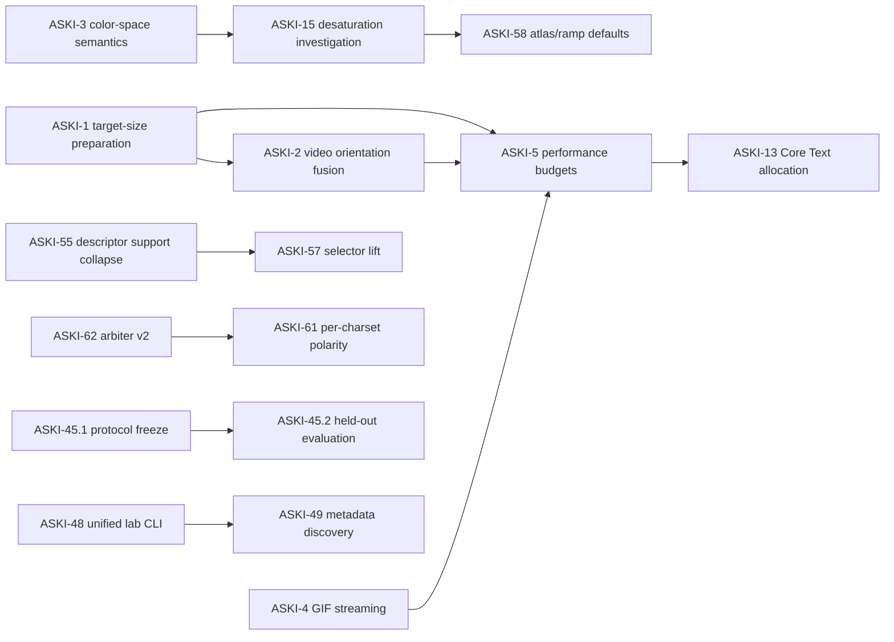

# ASKI backlog architecture audit and execution map

**Date:** 2026-09-02  
**Audit snapshot:** `main` at `e2c983ea89799fbc047e4eeb1c48f8ee392d2810`  
**Scope:** all live Backlog.md tasks under `backlog/tasks/`, archived-task context, recent merged PRs, task dependencies, parent/subtask structure, and current research validity state.

---

## Status at landing — 2026-09-16

This audit was written on 2026-09-02 against `main` at `e2c983e` and landed on
2026-09-16 against `main` at `0443556`, thirty-nine commits later. Its snapshot was
correct when written: the 69 live tasks / 38 Done / 31 To Do / 0 In Progress
count reconstructs exactly at `e2c983e`. It is preserved here as a dated record
of what was proposed and on what evidence, not as current instruction.

Six of its named subjects closed in the interval, and one referenced a subsystem
that was deleted. The withdrawals below are marked inline in the body as well, so
no section can be read as a live instruction on its own.

### What moved

| | 2026-09-02 | 2026-09-16 |
|---|---|---|
| Live task files | 69 | 79 |
| Done | 38 | 49 |
| To Do | 31 | 27 |
| In Progress | 0 | 3 — ASKI-41, ASKI-62, ASKI-73 |

Closed in the interval: ASKI-16, ASKI-29, ASKI-48, ASKI-50, ASKI-51, ASKI-66.
Created in the interval, and therefore absent from every map below: ASKI-67,
ASKI-68, ASKI-69, ASKI-70, ASKI-71, ASKI-72, ASKI-73, ASKI-74, ASKI-75 and
ASKI-76. ASKI-75 measures the build and binary tax of the unified CLI after
ASKI-48 and belongs with EPIC D; ASKI-76 decides the pre-1.0 `ASCIICharacterSet`
extension boundary and closes the residual public research API, which is EPIC A
work with a D consequence.

### Withdrawn

- **ASKI-16.3** (§1.3.G, §2 EPIC A, §3, §4, §6 Lane 1, §10, §13). The `.edgeMap`
  algorithm was deleted at `8bb6859` — both kernels, the canonical templates and
  the tests. `grep -ri edgeMap Sources/` returns nothing, and `ASCIIAlgorithm`
  declares only `logPolar` and `dotMatrix`. ASKI-16 closed Done on the removal
  branch of its AC#2; its verdict records that "the conditional retention
  experiment in AC3 is therefore not applicable" — AC#3 being precisely the
  edgeMap-local matcher this subtask would have pre-registered. There is nothing
  left to build the matcher on.
- **The ASKI-29 reparent under ASKI-55** (§1.3.C, §2 EPIC C, §3, §4, §10, §13).
  ASKI-29 is Done, and the claimed scope overlap was adjudicated the other way:
  its own notes record that the shipping-regime question "remains separate from
  the shipping 2-3/60 support question", and its Final Summary reports the KILL
  held at shipping support. This document anticipated the distinction itself in
  §1.3.H's "Important nuance" paragraph, which turned out to govern. ASKI-29 is
  also now an upstream dependency of ASKI-68, which would read oddly beneath an
  unstarted ASKI-55. What survives is the ASKI-55 ownership statement, which is
  still correct.
- **The parent-based epic migration** (§2's `parent_task_id` instruction, §10's
  "attach the listed live children", §13's "every current To Do leaf has exactly
  one sensible epic parent"). The pinned Backlog.md CLI (1.52.0) accepts
  `-p, --parent` only on `task create`. `task edit` has no parent flag and there
  is no `move` or `reparent` subcommand, so no existing task can be reparented —
  and `docs/agents/backlog.md` forbids hand-editing `backlog/tasks/`. Creating the
  seven parents without being able to attach any child yields seven empty shells
  that falsely imply the leaves beneath them are accounted for. The epic taxonomy
  in §2 and §5 stays useful as documentation; the mechanism does not.
- **§11's recommended first working set**, and the §6 Lane 3 head. ASKI-66 (the
  research slot) and ASKI-48 (one arm of the product slot) are both Done. The
  repository already sits at the three-leaf ceiling §7 proposes, with ASKI-41,
  ASKI-62 and ASKI-73 — and `docs/Research/2026-09-03-future-direction-and-architecture.md`
  names ASKI-73 and ASKI-62 as the two units to finish. Adopting §11 as written
  would evict both.
- **The ASKI-51 pull-ins** (§2 EPIC E, §6, §10). ASKI-51 is Done and already
  consumed by ASKI-71.
- **§6/§2's "keep ASKI-41 parked by policy."** ASKI-41 is In Progress with a
  recorded HOLD, and the architecture note places ASKI-74 → ASKI-41 inside its
  sequence. It is blocked on ASKI-74 and on a final Swift 6.4 / Xcode 27
  toolchain, not parked.

### Execution order is owned elsewhere

`docs/Research/2026-09-03-future-direction-and-architecture.md`, written one day
after this audit, is the settled project decision record and owns the execution
order. Steps 1–6 of its §5 are complete. Where §6 and §11 of this document
disagree with it, that note governs.

### Adopted, and applied in the same change

- `ASKI-15` depends on `ASKI-3`. Stronger than argued here: ASKI-3 records that
  the raster paths construct Generic RGB `CGColor`s, which "materially changes
  non-neutral sRGB and Display P3 values" — the exact output ASKI-15 measures.
  ASKI-15's glyph-pick half traces `sampledCellColor` / `finalizeColor`, upstream
  of the defect, so only its PNG-saturation half is contaminated.
- `ASKI-58` depends on `ASKI-15`, for the reason given in §2 EPIC G.
- `ASKI-39` raised from low priority. Still the only priority recommendation here
  that is not moot.
- Stale-narrative corrections on ASKI-40 and ASKI-66 (§10).

### Corrected

- **`ASKI-57 → ASKI-55` is not the right edge.** ASKI-55's own notes record that
  "support count did not track quality", which removes the mechanism this document
  used — restore support, ranking changes, ASKI-57's verdict moves. What actually
  gates ASKI-57 is its AC#2 perceptual discriminator, which ASKI-62 v2 supplies.
  Running ASKI-55 before ASKI-57 is the scheduling preference §9 of this document
  says to keep out of the graph. No edge added.
- **`ASKI-61 → ASKI-62` is correct in substance but over-blocks.** ASKI-61's AC#4
  is genuinely blocked on the v2 protocol. But a Backlog.md edge is task-granular,
  and ASKI-62's instrument already shipped — what remains is AC#4, a blinded
  51-sheet human sitting. ASKI-61's AC#1/2/3/6/7 are measurement and instrument
  work needing none of it. A hard edge would freeze five criteria to protect one,
  behind a gate whose remaining step is scheduling people. Recorded in ASKI-61's
  notes instead of the dependency list.
- **§1.2 draws two arrows backwards.** "ASKI-49 → ASKI-48" and "ASKI-62 →
  ASKI-56" read there as the upstream blocking the downstream; §2 and §4 state
  the correct direction.
- **§2 EPIC D omits a dependency.** ASKI-48 acquired `ASKI-70` on 2026-09-03,
  one day after the snapshot.
- **Ten real edges appear nowhere in this document**: `ASKI-19 → ASKI-6`,
  `ASKI-38 → ASKI-6`, `ASKI-34 → ASKI-17`, `ASKI-30 → ASKI-32`,
  `ASKI-44 → ASKI-43` existed at the snapshot; `ASKI-41 → ASKI-74`,
  `ASKI-48 → ASKI-70`, `ASKI-68 → {29, 50, 66}`, `ASKI-71 → {51, 68, 69}`,
  `ASKI-72 → {16, 68, 69}` were added after it. §1.3.A's "the backlog is too
  flat" holds among the open tasks and not among the closed ones.
- **§1.1 names the wrong mechanism.** `backlog.config.yml` does not say the
  checked-in branch is queue truth; it sets `remote_operations: false` and
  `check_active_branches: false`, which is what makes the inference correct.
- **No false-completion claims.** Every id in §2 EPIC C's completed-foundations
  list and in all six §5 maps is Done today. Those maps are incomplete, not wrong:
  A gains ASKI-16 and ASKI-71; B gains ASKI-72; C gains ASKI-29, ASKI-50,
  ASKI-66, ASKI-68, ASKI-69; D gains ASKI-48; E gains ASKI-51 and ASKI-70.

### Found while verifying, not proposed here

- **ASKI-58 needs more than a dependency edge.** Its description prescribes
  directional edge glyphs "(ASKI-16.2 tangent fix applied)" — machinery deleted
  at `8bb6859`. It also has no acceptance criteria, and its referenced downstream-website
  image and HTML are absent from this checkout. It is not pullable as written.
- **Eight Done tasks carry unchecked acceptance criteria** — ASKI-16.1, ASKI-16.2,
  ASKI-26, ASKI-30, ASKI-42, ASKI-46, ASKI-52, ASKI-54. `backlog task list
  --plain` renders these as `Done … (ac: 0/4)`, which reads as unfinished work.
  Fixable with `--check-ac`; not done here.
- **ASKI-73 fits none of the seven epics.** It is product validation, not a visual
  experiment; EPIC G is the nearest and is wrong in kind.

---

## Executive summary

ASKI does not have a task-volume problem so much as a work-graph problem.

The repository currently has **69 live task files** under `backlog/tasks/`: **38 Done, 31 To Do, 0 In Progress**, plus archived ASKI-14. The individual tasks are generally strong and unusually evidence-rich, but the queue is mostly flat. Dependencies exist where they were discovered locally, while higher-order relationships — foundation vs experiment, parent vs leaf, measurement gate vs implementation, optional exploration vs release blocker — are not represented consistently.

The result is a backlog that is locally precise but globally hard to schedule. Several To Do tasks can invalidate the interpretation of other To Do tasks, some related tasks duplicate the same failure family, and completed research has changed the meaning of older work without a single dependency map showing that change.

This audit recommends seven parent epics, a small number of real dependency edits, two hierarchy changes, one new edgeMap subtask, and an explicit execution policy. The goal is **not** to make everything depend on everything else. The graph should encode only true blockers. Ordering preferences belong in the execution plan.

The immediate development posture should be:

1. Re-establish measurement truth after ASKI-65 via ASKI-66.
2. Fix foundational color semantics and image preparation before tuning visual defaults or performance budgets.
3. Consolidate descriptor-support work around ASKI-55 before promoting selector experiments such as ASKI-57.
4. Finish the arbiter-v2 instrument (ASKI-62) before ASKI-61 can make a promotion judgment.
5. Keep CLI/product work moving in parallel because ASKI-48 is now unblocked by the merged CLI-root and inspect PRs.
6. Treat flaky tests and Core Text raster drift as gate/reproducibility work, not background cleanup.
7. Keep speculative visual/temporal experiments explicitly outside the critical path until the foundation lanes are healthy.

## Repository constraint: apply task mutations only through Backlog.md

`docs/agents/backlog.md` and `AGENTS.md` explicitly forbid direct edits under `backlog/tasks/`. Task creation, parent changes, dependencies, notes, status, and other metadata must be applied using the Backlog.md CLI.

Accordingly, this document is the migration specification. **Do not hand-edit task frontmatter to apply it.** Use `backlog task create` / `backlog task edit` on a work branch, inspect `--help` for the exact field flags supported by the pinned CLI, and commit the CLI-produced files.

This distinction matters here: the audit can safely reorganize the *architecture* in this PR, but rewriting task files through GitHub's contents API would violate the repository's own bookkeeping rule.

---

# 1. Current-state audit

## 1.1 Queue shape

- Live tasks: 69
- Done: 38
- To Do: 31
- In Progress: 0
- Archived: ASKI-14
- Explicit parent/subtask families already in use:
  - ASKI-16 → ASKI-16.1, ASKI-16.2
  - ASKI-45 → ASKI-45.1, ASKI-45.2
- Dependency metadata is present, but primarily captures local implementation order rather than an end-to-end work graph.

The absence of any `In Progress` task is a process smell. Recent PR activity proves work is happening, but the checked-in backlog cannot tell an agent which leaf is actually owned. Since `backlog.config.yml` intentionally treats the checked-in branch as queue truth, status should reflect active branches rather than remaining permanently binary To Do/Done.

## 1.2 What is already working well

Several existing patterns should be preserved and generalized:

- **ASKI-5** correctly waits on ASKI-1, ASKI-2 and ASKI-4 before enforcing performance budgets. This is a good example of a real convergence gate.
- **ASKI-13** correctly waits on ASKI-5; micro-optimization follows representative budgets rather than preceding them.
- **ASKI-45.1 → ASKI-45.2** cleanly separates protocol freeze from decisive held-out evaluation.
- **ASKI-49 → ASKI-48** keeps machine-readable discovery downstream of the unified CLI surface.
- **ASKI-62 → ASKI-56** already recognizes that a new arbiter protocol must build on the existing perceptual-arbiter instrument.
- Completed tasks frequently preserve negative results instead of silently rewriting the thesis. That research discipline is worth protecting.

## 1.3 Structural problems found

### A. The backlog is too flat

Most leaf tasks have no parent even when they clearly belong to a durable workstream. This makes priority changes look like global task reshuffling instead of movement inside a stable product/research architecture.

### B. Resolved ancestry and active blocking are mixed conceptually

A completed predecessor such as ASKI-65 may explain why a task exists without needing to remain an active blocker. Parentage/references should carry genealogy; `dependencies` should describe work that must complete before the leaf can finish safely.

### C. ASKI-29 and ASKI-55 overlap materially

> **WITHDRAWN 2026-09-16.** ASKI-29 is Done and the overlap was adjudicated the other way. See *Status at landing* above.

Both address the descriptor-support-collapse regime in which the shipping preset carries only roughly 2–3 of 60 bins. ASKI-29's remaining value is a narrow replay/interpretation of the historical kill record at shipping support. ASKI-55 is the broader root-cause and intervention task. Keeping both as peer roots invites duplicated experiments and conflicting conclusions.

### D. ASKI-61 is missing a true dependency on ASKI-62

> **CORRECTED 2026-09-16.** Correct in substance, but the edge over-blocks at task granularity and was not added. See *Status at landing* above.

ASKI-62 explicitly exists to add converter-level arbiter arms needed to score a polarity treatment and says it unblocks ASKI-61's promotion judgment. ASKI-61 therefore should not be dependency-free.

### E. ASKI-57 is premature while ASKI-55 is unresolved

> **CORRECTED 2026-09-16.** ASKI-55's own notes record that support count did not track quality, which removes this mechanism. No edge added. See *Status at landing* above.

ASKI-57 investigates selector rules that beat current baselines under the known sparse-support regime. If ASKI-55 restores descriptor support and the ranking changes, ASKI-57's selector verdict can move. ASKI-55 is therefore a real upstream dependency for any promotion-oriented ASKI-57 result.

### F. ASKI-15 should not measure color behavior before ASKI-3

ASKI-15 is a desaturation investigation. ASKI-3 is a known color-space-semantics correctness issue in image/effects rendering. A color-quality regression investigation performed before fixing the color-space contract risks measuring the wrong system.

### G. ASKI-16 needs one more real child, not more parent notes

> **WITHDRAWN 2026-09-16.** `.edgeMap` was deleted at `8bb6859`; ASKI-16 closed on its removal branch. ASKI-16.3 has no subject. See *Status at landing* above.

ASKI-16.1 and ASKI-16.2 are Done, but ASKI-16 is legitimately still open. Current evidence shows a separate unresolved mechanism: edgeMap's local matcher/template-vs-lanes behavior still fails orientation-appropriate selection even after the blank-glyph and diagonal-transposition fixes. Create ASKI-16.3 for that mechanism, then let the parent become a true roll-up again.

### H. ASKI-65 changed the validity graph

ASKI-65 fixed the sampling lattice and caused at least one prior research PASS to be retracted. ASKI-66 is therefore not ordinary follow-up research; it is a validity repair task that must happen before old experimental conclusions are used to justify new defaults.

Important nuance: ASKI-65's remainder/truncation defect and the oversample-2 descriptor-support collapse tracked by ASKI-25/26/29/55 are distinct. Do **not** encode ASKI-55 as technically dependent on ASKI-66 merely because ASKI-66 should be scheduled first. The first is an execution priority; the second would be a false dependency.

### I. Test/reproducibility tasks are undervalued

ASKI-39's contention flake and ASKI-51's Core Text raster drift both affect trust in the evidence pipeline. They should sit in an engineering-gate epic and be pulled early enough that later research and default promotion can rely on the gate.

### J. Product/CLI work is more unblocked than the task prose suggests

> **WITHDRAWN 2026-09-16.** ASKI-48 is Done. ASKI-49 is now the only open task in this epic. See *Status at landing* above.

The first-class `aski` CLI root and `aski inspect` work have merged. ASKI-48's prose prerequisites are therefore satisfied; its remaining explicit dependency ASKI-47 is also Done. ASKI-48 is ready to execute independently of the matcher-research critical path.

---

# 2. Proposed hierarchy

> **WITHDRAWN 2026-09-16.** The `parent_task_id` mechanism below is not executable: Backlog.md 1.52.0 sets a parent only at `task create`, and no existing task can be reparented. The taxonomy stands as documentation. See *Status at landing* above.

Use ordinary Backlog.md parent tasks as epics. Avoid inventing a second tracker or GitHub-issue hierarchy. Suggested convention:

- Parent title starts with `Epic:`.
- Add an `epic` label if the local CLI supports the desired label edit.
- Parent acceptance criteria describe workstream outcomes, not duplicate child ACs.
- Children use `parent_task_id`.
- A parent is **not** automatically a dependency of its children.
- Dependencies only encode true blockers.

## EPIC A — Core correctness & visual fidelity

**Purpose:** make renderer/converter output semantically correct before visual tuning.

Active children:

- ASKI-3 — Preserve grid color-space semantics.
- ASKI-7 — Define/preserve ragged ASCIIGrid geometry.
- ASKI-15 — Investigate full-color desaturation.
- ASKI-16 — edgeMap orientation selection parent.
  - ASKI-16.1 — Done: zero-descriptor blank-glyph collapse.
  - ASKI-16.2 — Done: diagonal bucket transposition.
  - **NEW ASKI-16.3** — edgeMap-local orientation matcher and regression matrix.

Hard dependency change:

- `ASKI-15 depends on ASKI-3`.

Parent close condition for ASKI-16:

- All three child mechanisms are closed and a 6-bucket × representative-charset regression matrix demonstrates orientation-appropriate glyph selection without regressing blank/non-edge behavior.

## EPIC B — Conversion & media performance

**Purpose:** remove avoidable image/media work, then enforce representative budgets.

Active children:

- ASKI-1 — Replace decoded-CGImage PNG round-trip with target-size preparation.
- ASKI-2 — Fuse video orientation into target-size preparation.
- ASKI-4 — Stream rendered GIF frames into ImageIO encoding.
- ASKI-5 — Enforce representative conversion/media performance budgets.
- ASKI-8 — GIF loop-count round-trip and metadata correctness.
- ASKI-13 — Per-cell Core Text allocation measurement/reduction.
- ASKI-64 — Optional lossless animated WebP encoder behind dependency decision.

Existing chain to keep:

```text
ASKI-1 ──> ASKI-2 ──┐
ASKI-4 ──────────────┼──> ASKI-5 ──> ASKI-13
ASKI-1 ──────────────┘
```

ASKI-8 is media correctness but independent of the performance chain.

ASKI-64 remains optional. ASKI-63 is already Done and should be referenced as the exact-target-size measurement foundation; the remaining real gate is the owner decision on accepting the first third-party encoder dependency. Do not make the whole epic wait on ASKI-64.

## EPIC C — Research validity & matcher selection

**Purpose:** make the matcher evidence chain valid, calibrated, perceptually gated, and promotion-safe.

Active children:

- ASKI-66 — Exact-lattice re-baseline and audit of pre-ASKI-65 verdicts.
- ASKI-55 — Descriptor-support-collapse root cause/intervention parent.
  - ASKI-29 — reparent as the narrow historical shipping-regime replay/kill-record subtask.
- ASKI-57 — Selector lift from ASKI-30/28 battery.
- ASKI-62 — Arbiter protocol v2 with converter-level arms.
- ASKI-61 — Per-charset polarity treatment under the arbiter gate.
- ASKI-50 — Metric-refresh audition on an archived decisive run.

Completed foundations to treat as evidence lineage, not open blockers:

- ASKI-25, 26, 27, 28, 30, 31, 32, 52, 53, 56, 60, 65.

Hard dependency changes:

- `ASKI-61 depends on ASKI-62`.
- `ASKI-57 depends on ASKI-55`.
- Reparent ASKI-29 under ASKI-55 instead of leaving it as a peer root.

Scheduling policy, **not** hard dependency:

- Run ASKI-66 before spending serious experimental budget on ASKI-55/57/61/50 so the team knows which archived claims survived the exact-lattice correction.
- ASKI-62 may proceed in parallel with ASKI-66 because it builds an instrument rather than relying on an old promotion verdict.
- ASKI-55 may also proceed independently if capacity exists because descriptor support collapse is a separate mechanism from ASKI-65's sampling remainder defect. The default scheduling order should still favor ASKI-66 first.

## EPIC D — CLI & automation surface

**Purpose:** make ASKI coherent and discoverable for humans, scripts, and agents.

Active children:

- ASKI-48 — Unified `aski lab ...` command tree.
- ASKI-49 — Versioned machine-readable `aski metadata` discovery.

Completed foundations:

- ASKI-46 — deterministic render manifest.
- ASKI-47 — swift-argument-parser 1.8.x.
- ASKI-63 — exact target-size render path.
- Merged first-class CLI-root and inspect PRs.

Existing dependency to keep:

- `ASKI-49 depends on ASKI-48`.

ASKI-48 is ready now and should run in parallel with core/research work rather than waiting behind it.

## EPIC E — Engineering gate & reproducibility

**Purpose:** make test/research results reproducible enough that downstream decisions can be trusted.

Active children:

- ASKI-39 — contention-flaky video effects E2E frame-count assertion.
- ASKI-41 — Swift 6.4 / Swift Build compatibility/performance lane; explicitly non-promotional.
- ASKI-51 — Core Text raster drift detection/regeneration strategy.

Completed foundations:

- ASKI-40 — privacy-hook path scanning.
- ASKI-42 — local check-gate performance work.
- ASKI-54 — `.build` relocation / EDR stall mitigation.

Priority adjustment:

- Raise ASKI-39 from low to at least medium operational priority. A flaky broad test filter damages confidence in every batch that uses it.
- Treat ASKI-51 as high-value reproducibility infrastructure even if its implementation remains a spike. Committed charset bytes that drift with OS/Core Text can make benchmark changes look algorithmic when they are environmental.
- Keep ASKI-41 isolated and non-blocking until its own evidence says promotion is justified.

## EPIC F — Glyph-over-image legibility

**Purpose:** produce a frozen, held-out decision on automatic legibility treatments for glyphs over imagery.

Active hierarchy already mostly correct:

- ASKI-45 — parent research question.
  - ASKI-45.1 — build/freeze protocol.
  - ASKI-45.2 — run held-out evaluation.

Completed foundations:

- ASKI-43 — active-region mask ground.
- ASKI-44 — mask/photo dissolve compositing exposed in demo/product surface.

Keep the existing hard chain:

```text
ASKI-43 (Done) -> ASKI-45.1 -> ASKI-45.2
```

ASKI-45 should be treated as a roll-up/verdict parent, not as a third experiment after 45.2.

## EPIC G — Exploratory visual & temporal experiments

**Purpose:** preserve high-upside experiments without allowing them to silently become release blockers.

Active children:

- ASKI-10 — saliency-budgeted adaptive detail allocation.
- ASKI-11 — motion-conditioned temporal gating / warping-error oracle.
- ASKI-12 — chroma-gated OKLCH interpolation.
- ASKI-58 — the downstream website's ASCII shader settings as measured atlas/ramp defaults.
- ASKI-59 — fixed glyph grid / moving sample field photo animation.

Hard dependency change:

- `ASKI-58 depends on ASKI-15` (and therefore transitively on ASKI-3).

Reason: ASKI-58 is explicitly evaluating settings for possible default adoption. It should measure the corrected color/fidelity system rather than use a known desaturation investigation as an unresolved confounder.

Soft sequencing:

- Run ASKI-58 before ASKI-59 if ASKI-59 will reuse its measured atlas/ramp/LUT outputs. Do not add a hard dependency unless the implementation actually consumes those artifacts.
- ASKI-10/11/12 remain independent research leaves unless a future frozen protocol establishes a shared prerequisite.

---

# 3. Proposed hard dependency graph

> **CORRECTED 2026-09-16.** Two of the four edges were adopted (ASKI-15 -> ASKI-3, ASKI-58 -> ASKI-15); ASKI-57 -> ASKI-55 was dropped and ASKI-61 -> ASKI-62 recorded in notes instead. The hierarchy blocks are withdrawn. See *Status at landing* above.

Only the edges below should be added/changed beyond existing dependencies.



Hierarchy changes that are **not dependency edges**:

```text
ASKI-55
└── ASKI-29  historical shipping-regime replay / kill-record interpretation

ASKI-16
├── ASKI-16.1  Done
├── ASKI-16.2  Done
└── ASKI-16.3  NEW: local orientation matcher + regression matrix
```

Research-validity scheduling gate that should **not** be encoded as a fake graph edge:

```text
Prefer ASKI-66 first
  ├─ then prioritize ASKI-55 -> ASKI-57
  ├─ then run/publish promotion-facing ASKI-61 after ASKI-62
  └─ then use ASKI-50 only with explicit historical/current-lattice labeling
```

---

# 4. Full active-task map

> **CORRECTED 2026-09-16.** Six rows have closed and eight tasks are missing. See *Status at landing* above.

| Task | Proposed epic | Structure / action | Hard dependency posture |
|---|---|---|---|
| ASKI-1 | B — Conversion & media performance | Root leaf; execute early | none |
| ASKI-2 | B | Keep as leaf after image prep | keep ASKI-1 |
| ASKI-3 | A — Core correctness | Root leaf; execute early | none |
| ASKI-4 | B | Root leaf; execute early/parallel | none |
| ASKI-5 | B | Convergence/performance gate | keep ASKI-1,2,4 |
| ASKI-7 | A | Small correctness leaf; pull early | none |
| ASKI-8 | B | Media correctness leaf; independent of perf chain | none |
| ASKI-10 | G — Exploration | Independent experimental leaf | none |
| ASKI-11 | G | Independent experimental leaf | none |
| ASKI-12 | G | Independent experimental leaf | none |
| ASKI-13 | B | Late optimization leaf | keep ASKI-5 |
| ASKI-15 | A | Color-quality investigation after semantic fix | **add ASKI-3** |
| ASKI-16 | A | Parent/roll-up, not implementation catch-all | new ASKI-16.3 child |
| ASKI-29 | C — Matcher evidence | Reparent/narrow under ASKI-55 | parent relationship, not peer root |
| ASKI-39 | E — Gate/reproducibility | Raise operational priority | none |
| ASKI-41 | E | Isolated compatibility experiment; non-blocking | none |
| ASKI-45 | F — Legibility | Verdict/roll-up parent | child completion, not a dependency edge |
| ASKI-45.1 | F | Protocol-build leaf | keep completed ASKI-43 ancestry |
| ASKI-45.2 | F | Decisive held-out evaluation | keep ASKI-45.1 |
| ASKI-48 | D — CLI | Ready now; independent lane | existing ASKI-47 is Done |
| ASKI-49 | D | Discovery after command-tree stabilization | keep ASKI-48 |
| ASKI-50 | C | Historical metric-refresh experiment | no hard edge; schedule after ASKI-66 |
| ASKI-51 | E | Reproducibility infrastructure; promote priority | none |
| ASKI-55 | C | Parent/root for descriptor-support-collapse work | no artificial ASKI-66 edge |
| ASKI-57 | C | Promotion-oriented selector lift | **add ASKI-55** |
| ASKI-58 | G | Default-oriented visual experiment | **add ASKI-15** |
| ASKI-59 | G | Exploratory animation leaf | soft order after ASKI-58 |
| ASKI-61 | C | Per-charset treatment/promotion verdict | **add ASKI-62** |
| ASKI-62 | C | Instrument/protocol prerequisite | keep completed ASKI-56 ancestry |
| ASKI-64 | B | Optional product extension; owner dependency gate | ASKI-63 already Done; no new unresolved edge |
| ASKI-66 | C | Highest-priority research-validity repair | ASKI-65 is Done ancestry |

---

# 5. Completed foundation map

> **CORRECTED 2026-09-16.** Incomplete, not wrong: every id listed is still Done, but ASKI-16, 29, 48, 50, 51, 66, 68, 69, 70, 71, 72 are missing. See *Status at landing* above.

Completed work should remain visible as lineage inside the epic architecture even though it should not clutter the live blocker graph.

## A — Core correctness & visual fidelity

- ASKI-16.1, ASKI-16.2
- ASKI-17
- ASKI-20
- ASKI-22
- ASKI-23
- ASKI-24
- ASKI-33
- ASKI-34
- ASKI-35
- ASKI-36
- ASKI-37

## B — Conversion & media performance

- ASKI-6
- ASKI-18
- ASKI-19
- ASKI-21
- ASKI-38

## C — Research validity & matcher selection

- ASKI-25
- ASKI-26
- ASKI-27
- ASKI-28
- ASKI-30
- ASKI-31
- ASKI-32
- ASKI-52
- ASKI-53
- ASKI-56
- ASKI-60
- ASKI-65

## D — CLI & automation surface

- ASKI-9
- ASKI-46
- ASKI-47
- ASKI-63

## E — Engineering gate & reproducibility

- ASKI-40
- ASKI-42
- ASKI-54

## F — Glyph-over-image legibility

- ASKI-43
- ASKI-44

ASKI-14 remains archived and should not be reintroduced into the live hierarchy unless its question becomes active again.

---

# 6. Execution plan

> **WITHDRAWN 2026-09-16.** Execution order is owned by `docs/Research/2026-09-03-future-direction-and-architecture.md` §5. See *Status at landing* above.

A dependency graph alone is not a schedule. Use three active lanes with a strict WIP ceiling.

## Lane 1 — Core / product correctness

Recommended pull order:

```text
ASKI-3 -> ASKI-15 -> ASKI-58
ASKI-7 can run as a small parallel correctness leaf
ASKI-16.3 can run once created
```

Why this order: semantic color correctness comes before diagnosing desaturation; desaturation is resolved before evaluating visual settings for default adoption.

## Lane 2 — Conversion / product surface

Recommended pull order:

```text
ASKI-1 -> ASKI-2 -> ASKI-5 -> ASKI-13
ASKI-4 -----------^ 
```

Independent pulls in this lane:

```text
ASKI-8
ASKI-48 -> ASKI-49
ASKI-64 only after explicit dependency/ownership decision
```

Why: the performance budget task should judge the final target-size/orientation/streaming pipeline, not intermediate code. The CLI work is independent and should not be starved by algorithm research.

## Lane 3 — Research validity / matcher

Recommended pull order:

```text
First: ASKI-66

Then two branches:
  ASKI-55 -> ASKI-57
  ASKI-62 -> ASKI-61

ASKI-50 remains a bounded side experiment after the exact-lattice audit is understood.
```

ASKI-62 may start in parallel with ASKI-66 if capacity exists because it is instrument construction. ASKI-61's final verdict must still wait for ASKI-62.

## Gate/reproducibility pull-ins

ASKI-39 and ASKI-51 should interrupt a lane when they threaten confidence in current work:

- Pull ASKI-39 before relying on broad video test filters for a major media change.
- Pull ASKI-51 before regenerating/promoting charset assets or claiming cross-machine reproducibility.
- Keep ASKI-41 outside normal WIP unless actively evaluating the future toolchain.

## Legibility lane

Do not parallelize the two decisive steps:

```text
ASKI-45.1 -> freeze -> ASKI-45.2 -> close/update ASKI-45 parent verdict
```

## Exploration queue

ASKI-10, 11, 12 and 59 are intentionally not on a critical path. Pull them only when:

- one of the three primary lanes has capacity,
- the experiment has a frozen question and stop condition,
- it does not require unresolved foundation behavior,
- the result can be recorded without silently changing a product default.

---

# 7. WIP and ownership policy

The current 0-In-Progress state makes coordination harder than necessary. Adopt a simple rule:

- **Maximum 3 In Progress leaf tasks repo-wide by default:** one core/product, one research, one CLI/gate/secondary lane.
- A task becomes `In Progress` when a working branch/worktree exists and substantive work starts.
- A task returns to `To Do` if the branch is abandoned or deliberately parked.
- Parent epics are not counted against WIP. They are containers and may remain To Do/In Progress according to the team's preferred roll-up convention.
- Do not put multiple agents on the same leaf without explicit partitioning into subtasks.

This gives the checked-in backlog enough state to answer “what should I work on?” without inspecting open branches manually.

---

# 8. Research-task design rule

ASKI's strongest recent research structure should become the default template:

1. **Question / parent** — what decision are we trying to make?
2. **Instrument/protocol leaf** — freeze corpus, arms, metrics, thresholds, artifacts, and stop conditions.
3. **Decisive evaluation leaf** — run the frozen protocol without changing the hypothesis mid-flight.
4. **Promotion leaf only if needed** — implementation/default change is separate from evidence generation.

ASKI-45.1/45.2 already models this well. ASKI-62/61 is close and should be made explicit with the missing dependency. ASKI-55/57 should follow the same principle: first repair/understand descriptor support, then judge selector promotion.

Negative results close a research leaf. They do not keep the task perpetually open until a positive result appears.

---

# 9. Dependency semantics

Use these tests before adding a dependency:

### Add a hard dependency when

- the downstream task cannot satisfy its acceptance criteria without the upstream artifact,
- the upstream fix can materially invalidate the downstream measurement,
- the downstream promotion gate explicitly requires the upstream instrument,
- or the downstream implementation is built on an upstream API/contract that does not yet exist.

### Do not add a dependency merely because

- a task historically caused another task to be created,
- both tasks touch the same subsystem,
- one would be nicer to do first,
- or an old completed task provides evidence lineage.

Use parentage, references, notes, and the execution plan for those relationships.

By these rules ASKI-61's promotion verdict (AC#4) depends on the ASKI-62 instrument in substance, while “ASKI-66 should run before ASKI-55” is scheduling policy rather than a hard edge.

> **CORRECTED 2026-09-16.** The task-granular `ASKI-61 -> ASKI-62` edge was NOT added at landing: it would mark all of ASKI-61 unstartable and freeze AC#1/#2/#3/#6/#7, which need none of ASKI-62, to protect AC#4 alone. The relationship is recorded in ASKI-61's notes instead. See *Status at landing*. Do not reintroduce the edge from this example.

---

# 10. Task-specific migration actions

> **CORRECTED 2026-09-16.** Only two of the four dependency edges (ASKI-15 -> ASKI-3, ASKI-58 -> ASKI-15), the ASKI-39 priority raise, and the stale-narrative cleanup were executable and applied; ASKI-57 -> ASKI-55 was dropped and ASKI-61 -> ASKI-62 went to notes. See *Status at landing* above.

Apply these changes with the Backlog.md CLI on the migration branch.

## Create seven parent epics

Create parent tasks with these titles/descriptions, then attach the listed live children via `parent_task_id`:

1. `Epic: Core correctness & visual fidelity`
2. `Epic: Conversion & media performance`
3. `Epic: Research validity & matcher selection`
4. `Epic: CLI & automation surface`
5. `Epic: Engineering gate & reproducibility`
6. `Epic: Glyph-over-image legibility`
7. `Epic: Exploratory visual & temporal experiments`

The exact generated ASKI IDs should be accepted from Backlog.md; do not pre-reserve numbers in documentation.

## Create ASKI-16.3 child

Suggested title:

`edgeMap local orientation matcher selects orientation-appropriate glyphs across canonical buckets`

Minimum acceptance criteria:

- Implement or experimentally validate an edgeMap-local orientation-selection path that does not collapse to the existing template/lane failure.
- Cover blank plus the canonical nonblank orientation buckets, including both diagonals.
- Run at least `.diagonal`, `.mixed`, and one sparse/non-directional charset where appropriate; document unsupported charsets instead of forcing a meaningless pass.
- Add a regression matrix proving ASKI-16.1 and ASKI-16.2 stay fixed.
- Re-run ASKI-16 parent acceptance criteria and close the parent only if the original orientation-selection contract is actually satisfied.

## Reparent/narrow ASKI-29

Make ASKI-29 a child of ASKI-55. Its remaining scope should be historical replay/interpretation, not a second root-cause program.

ASKI-55 owns:

- root cause of shipping descriptor support collapse,
- one support-restoring intervention,
- measurement of whether restored support changes selector/ranking verdicts,
- and the go/no-go decision for downstream selector work.

ASKI-29 owns only the narrow kill-record replay needed as evidence inside that program.

## Add dependency edges

- ASKI-15 -> ASKI-3
- ASKI-57 -> ASKI-55
- ASKI-61 -> ASKI-62
- ASKI-58 -> ASKI-15

Do not add artificial edges from ASKI-66 to every research task. Put the “audit first” rule in epic notes/priority instead.

## Priority/status cleanup

- Raise ASKI-39 operational priority.
- Raise ASKI-51 reproducibility priority.
- Keep ASKI-41 explicitly non-blocking.
- Reconcile stale narrative notes where a task says “In Progress” while frontmatter is Done (ASKI-40 is one observed example).
- When migration work begins, mark the chosen leaf tasks In Progress rather than leaving the queue at 0.

---

# 11. Recommended first working set after migration

> **WITHDRAWN 2026-09-16.** ASKI-66 and ASKI-48 are Done. The live working set is ASKI-41, ASKI-62, ASKI-73. See *Status at landing* above.

With a three-leaf WIP ceiling, the strongest initial set is:

### Research slot — ASKI-66

Highest information value. It repairs the evidence base after ASKI-65 and tells us which old conclusions are safe to reuse.

### Core slot — ASKI-3

Foundational color-space correctness. It blocks a trustworthy desaturation investigation and therefore visual-default work.

### Product/performance slot — ASKI-1 **or** ASKI-48

Choose based on current product pressure:

- ASKI-1 if conversion performance is the priority; it starts the ASKI-1 -> 2 -> 5 chain.
- ASKI-48 if agent/developer CLI surface is the priority; it is already unblocked and can land without touching the matcher research lane.

ASKI-39 or ASKI-51 should replace one of these temporarily if gate trust becomes the immediate limiting factor.

---

# 12. Parent epic completion criteria

## Core correctness & visual fidelity

Close when all known correctness leaves are resolved or explicitly killed, ASKI-16 is truly closed, and visual-default experiments no longer depend on unresolved semantic defects.

## Conversion & media performance

Close when target-size/orientation/streaming changes are complete, representative budgets are enforced, and remaining encoder extensions are either shipped or explicitly optional/deferred.

## Research validity & matcher selection

Close when exact-lattice historical validity is reconciled, descriptor support has a documented verdict, the arbiter can score converter-level treatments, and any promoted selector/default has passed the agreed measurement/perceptual gates.

## CLI & automation surface

Close when the lab command tree and versioned metadata discovery are stable enough for humans and agents to enumerate supported capabilities without parsing help text heuristically.

## Engineering gate & reproducibility

Close only when known gate flakes and environment-bound artifact drift have explicit detection/handling strategies. Toolchain experiments may remain non-promoted without blocking closure if they are clearly marked exploratory.

## Glyph-over-image legibility

Close with a frozen protocol plus held-out result and a recorded ship/kill/defer verdict.

## Exploratory visual & temporal experiments

This epic is intentionally evergreen. Do not use epic closure as a release criterion. Periodically archive killed/stale experiments rather than allowing it to become an infinite parking lot.

---

# 13. Migration Definition of Done

> **WITHDRAWN 2026-09-16.** Two items are unreachable in the pinned CLI (epic parents, the ASKI-29 nesting) and one targets a deleted subsystem (ASKI-16.3). See *Status at landing* above.

The backlog reorganization itself is complete when:

- Seven parent epics exist in Backlog.md.
- Every current To Do leaf has exactly one sensible epic parent.
- ASKI-16.3 exists under ASKI-16.
- ASKI-29 is nested under ASKI-55 and its description no longer overlaps the parent program.
- The four recommended hard dependency changes are applied.
- No new false dependencies were added merely for chronology.
- ASKI-39/51 priority posture is reconciled.
- Stale status language is cleaned up.
- At least one actual leaf is marked In Progress when development resumes.
- `backlog task list --plain --status "To Do"` and `--status "In Progress"` produce a queue an agent can schedule without reconstructing hidden context from research docs.
- The task changes were generated through the Backlog.md CLI, not manual edits to `backlog/tasks/`.

---

# 14. Net effect

After this migration, ASKI should read as a small set of durable programs rather than a chronological pile of discoveries:

```text
Core correctness
  -> visual fidelity/defaults

Conversion/media foundation
  -> performance budgets
  -> late micro-optimization / optional encoders

Research validity
  -> descriptor support
  -> selector promotion
  -> perceptual arbitration

CLI surface
  -> machine-readable discovery

Gate/reproducibility
  -> trustworthy CI and research artifacts

Legibility
  -> frozen protocol
  -> held-out verdict

Exploration
  -> bounded experiments that do not block the product
```

That architecture preserves ASKI's research depth while making the next action obvious, reducing duplicate work, and preventing experimental conclusions from outrunning the correctness and reproducibility foundations they depend on.
